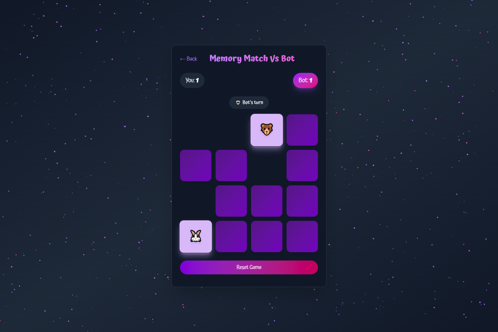

# 🪐 Cosmic Memory Game

<div align="center">
  
  
  
</div>

## 🌌 Project Overview

Cosmic Memory Game is an immersive, space-themed memory challenge that takes players on an intergalactic journey of mental agility and strategic thinking. Test your memory skills across multiple game modes while exploring a visually stunning cosmic landscape.

## 📸 Screenshots

<div align="center">
  
  
  
  
</div>


## ✨ Features

- 🎮 **3 Unique Game Modes**
  - Adventure Mode: Explore progressively challenging memory challenges
  - VS Bot Mode: Compete against an intelligent AI opponent
  - Daily Challenge: Fresh memory tests every day

- 🌠 **Stunning Cosmic Visuals**
  - Animated starry backgrounds
  - Mesmerizing gradient color schemes
  - Responsive design that adapts to any device

- 🤖 **Intelligent Gameplay**
  - Adaptive AI difficulty levels
  - Dynamic game mechanics
  - Real-time performance tracking

- 📱 **Fully Responsive**
  - Seamless experience across mobile, tablet, and desktop
  - Optimized touch and click interactions

## 🚀 Quick Start Guide

1. Clone the repository
```bash
git clone https://github.com/Rid-Lad/memory-card-game.git
```

2. Navigate to the project directory
```bash
cd memory-card-game
```

3. Install dependencies
```bash
npm install
```

4. Start the development server
```bash
npm run dev
```

## 🛠️ Tech Stack

<div align="center">
  
</div>

- **Frontend**: React
- **Styling**: Tailwind CSS
- **Build Tool**: Vite
- **Language**: JavaScript

## 📦 Dependencies

- React 18.x
- Tailwind CSS
- Vite
- Additional dependencies listed in `package.json`

## 🎯 Contributing

Contributions are welcome! Please feel free to submit a Pull Request.

1. Fork the repository
2. Create your feature branch (`git checkout -b feature/AmazingFeature`)
3. Commit your changes (`git commit -m 'Add some AmazingFeature'`)
4. Push to the branch (`git push origin feature/AmazingFeature`)
5. Open a Pull Request


## 🌟 Support

Found a bug or have a suggestion? Please open an issue in the GitHub repository.

---

**Happy Gaming! 🚀🌠**
